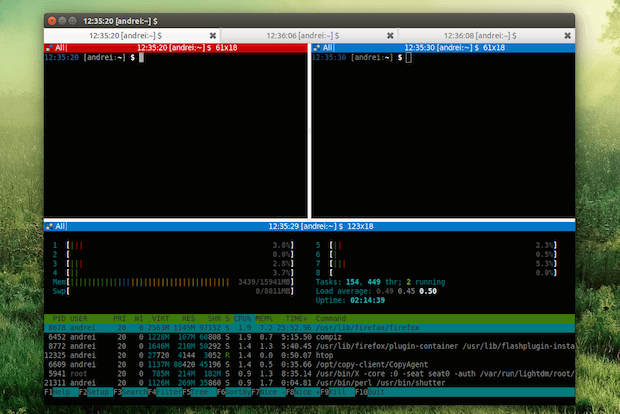

# Dotfiles

Here will be saved the configuration of the tools that we use in our workflow

Following the overview descripted in the [environment overview page](../README.md)

Mainly the ideia is use in our computer:

- TERMINATOR
- VIM
- ZSH
- DOCKER 
- GIT 
- VSCODE

Inside the docker, this can be in our on computer or in Rhino 
- TMUX
- VIM
- ALL ROS STUFF
- GRAPHICAL TOOLS OF ROS
- BUILDING THE CATKIN

---

## Installation

To keep everybody in sync all the instalation can be done via ansible and inside the docker everything is already preconfigured in the creation of the image via dockerfile.

So to install in your own computer just [follow this](ansible/README.md)

## About the whole environment 

Dotfiles come from the fact that the configuration files are the .zsh .tmux .vimrc saved inside the folder.

### ZSH

ZSH, also called the Z shell, is an extended version of the Bourne Shell (sh), with plenty of new features, and support for plugins and themes. Since it’s based on the same shell as Bash, ZSH has many of the same features, and switching over is a breeze.

*So Why Use It?*

ZSH has too many features to list here, some just minor improvements to Bash, but here are some of the major ones:

- Automatic cd: Just type the name of the directory
- Recursive path expansion: For example “/u/lo/b” expands to “/usr/local/bin”
- Spelling correction and approximate completion: If you make a minor mistake typing a directory name, ZSH will fix it for you
- Plugin and theme support: ZSH includes many different plugin frameworks
- Plugin and theme support is probably the coolest feature of ZSH and is what we’ll focus on here.

*Configuration*

The main configuration file is the `dotfiles/zsh/zshrc.sh`

Zsh Main Plugin - Oh My Zsh

Oh My Zsh is a delightful, open source, community-driven framework for managing your Zsh configuration. It comes bundled with thousands of helpful functions, helpers, plugins, themes, and a few things that make you shout...

[Theme of oh-my-zsh Agnoster](https://github.com/agnoster/agnoster-zsh-theme)

*What does it show?*

- If the previous command failed (✘)
- User @ Hostname (if user is not DEFAULT_USER, which can then be set in your profile)
- Git status
  - Branch () or detached head (➦)
  - Current branch / SHA1 in detached head state
  - Dirty working directory (±, color change)
- Working directory
- Elevated (root) privileges (⚡)

| Plugins | What It Does |
|------------|--------------|
| [git](https://github.com/robbyrussell/oh-my-zsh/wiki/Plugins#git)               | Adds a lot of git aliases and functions for day-to-day git operations. |
| [gitfast](https://github.com/robbyrussell/oh-my-zsh/wiki/Plugins#gitfast)               | Enables the zsh completion from git.git folks, which is much faster than the official one from zsh. A lot of zsh-specific features are not supported, like descriptions for every argument, but everything the bash completion has, this one does too (as it is using it behind the scenes). Not only is it faster, it should be more robust, and updated regularly to the latest git upstream version. |
| [docker](https://github.com/robbyrussell/oh-my-zsh/wiki/Plugins#docker)            | Auto complete arguments and options for all docker commands; Show containerIDs and Images for tab completion where applicable (screenshots) |
| [colored-man-pages](https://github.com/robbyrussell/oh-my-zsh/tree/master/plugins/colored-man-pages) | This plugin adds colors to man pages. |
| [colorize](https://github.com/robbyrussell/oh-my-zsh/tree/master/plugins/colorize)          | With this plugin you can syntax-highlight file contents of over 300 supported languages and other text formats. Colorize will highlight the content based on the filename extension. If it can't find a syntax-highlighting method for a given extension, it will try to find one by looking at the file contents. If no highlight method is found it will just cat the file normally, without syntax highlighting. |
| [extract](https://github.com/robbyrussell/oh-my-zsh/wiki/Plugins#extract)           | Extract any archive file by using `extract abc.tar.gz`;  Extract and remove original archive file by using `extract -r abc.zip` |
| [z](https://github.com/agkozak/zsh-z)                 | [Simillar to roscd but not only for ros](https://www.youtube.com/watch?v=qbNn5zJLZU0&list=PLu8EoSxDXHP7tXPJp5ZmUpuT7sFvrswzf&index=10) |
| history           | [Advanced History](https://www.youtube.com/watch?v=s_h3NrrtETA&list=PLu8EoSxDXHP7tXPJp5ZmUpuT7sFvrswzf&index=8) |
| [vi-mode](https://github.com/robbyrussell/oh-my-zsh/tree/master/plugins/vi-mode)           | This plugin increase vi-like zsh functionality. See the gihub page |
| [zsh-autosuggestions](https://github.com/zsh-users/zsh-autosuggestions) | Searches your history while you type and provides suggestions |
| [zsh-syntax-highlighting](https://github.com/zsh-users/zsh-syntax-highlighting/tree/ad522a091429ba180c930f84b2a023b40de4dbcc) | Provides fish style syntax highlighting for zsh. | 

### VIM

Vim is a highly configurable text editor built to enable efficient text editing. It is an improved version of the vi editor distributed with most UNIX systems.

It is our main editor tool directly in the terminal.

*Configuration*

The main configuration file is the `dotfiles/vim/vimrc.vim`

[vim cheatsheet](https://rumorscity.com/2014/08/16/5-best-vim-cheat-sheet/)

### TERMINATOR

At its simplest Terminator is a terminal emulator like xterm, gnome-terminal, konsole, etc. At its most complex it lets you fly... metaphorically at least. Take a look at the following list:

From the simple...

- Arrange terminals in a grid-like structure
- Tabs
- Drag and drop re-ordering of terminals
- Lots of keyboard shortcuts
- Save multiple layouts and profiles via GUI preferences editor
- Simultaneous typing to arbitrary groups of terminals
- Extensible through plugins

**We will use this tool as our terminal**

[Treminator Cheatsheet](https://www.cheatography.com/juanb/cheat-sheets/terminator/)

### TMUX

[See this video about tmux](https://www.youtube.com/watch?v=BHhA_ZKjyxo)

Tmux is a terminal multiplexer where you can have diferent sessions, window and panes.

It make much easier to work over ssh and inside docker.

Since it run all sessions inside the tmux server, it is possible to share the same shell terminal over diferent computers and at the same time.

**We will use this while working inside a docker container or rhino over ssh**

Special Keybindings:

| Keybinding | What It Does |
|------------|--------------|
| Ctrl-a     | Enter in command mode       |
| Ctrl-a ; - | Divide the pane horizontaly |
| Ctrl-a ; | | Divide the pane vertically  |
| Shift - arrow right | Change to the right window |
| Shift - arrow left | Change to the left window  |
|------------|--------------|
| Ctrl-a ; ? | See list of all commands |
| Ctrl-a ; c | Create new windows       |
| Ctrl-a ; x | kill pane / window       |
| Ctrl-a ; p | Previous window       |
| Ctrl-a ; n | Next window       |
| Ctrl-a ; [ | To scroll       |

Also when selecting things, FIRST press shift

Also you can click with the mouse in the diferent panes and move them.

*Configuration*

The main configuration file is the `dotfiles/tmux/tmux.conf`

[Tmux Cheatsheet](http://atkinsam.com/documents/tmux.pdf)

---

## Customization

During the installation, the scripts put a links in the real configuration files:
- /home/user/zsh.conf
- /home/user/tmux.conf
- /home/user/vimrc.vim

Pointing to the files inside the dotfiles.

So if you want to do a customization for only you, you can do after the link directly in the files inside your home folder.
And if you want to make a contribution to the configuration of everyone, make it in the dotfiles, then commit.
. |
